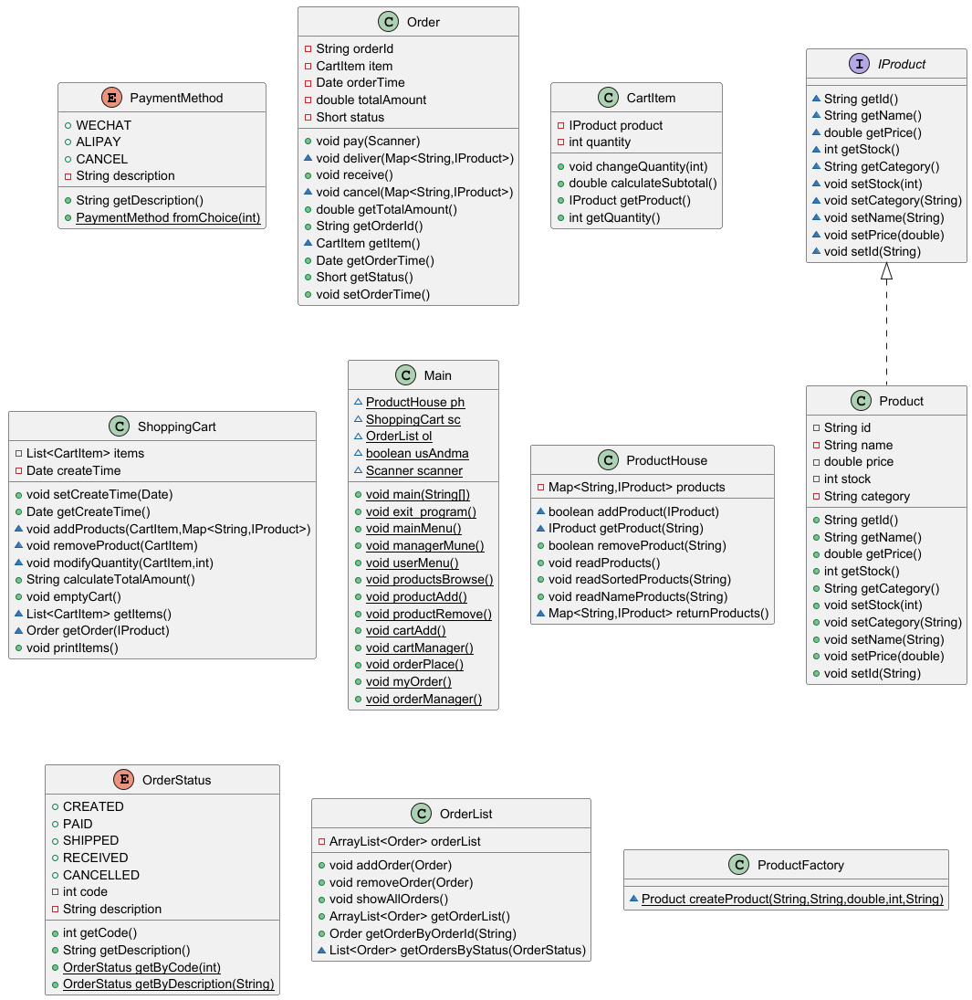
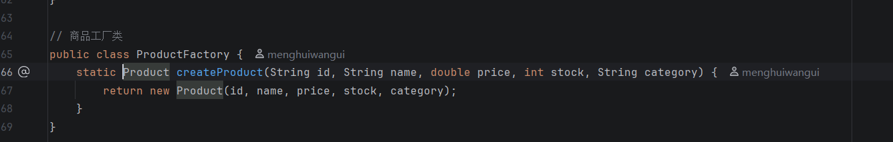
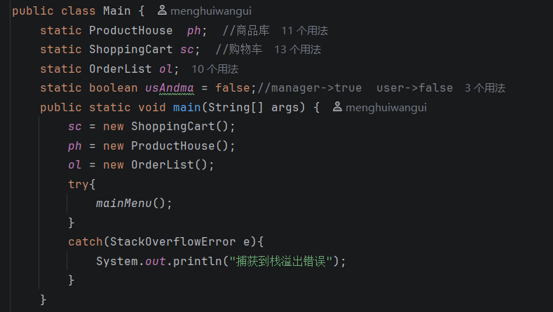
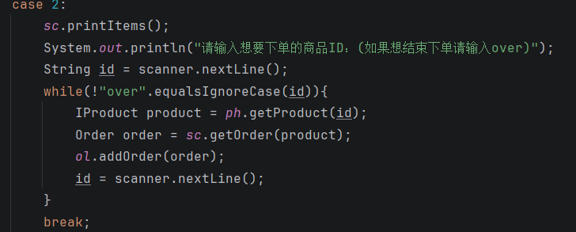

# JavaOOPprojects

一个具有完整流程的简易购物车系统，功能包括：1.商品列表展示与分类 2.购物车增删改查、批量操作 3.实时计算总价、折扣

# 项目概述与功能展示
一个具有完整流程的简易购物车系统
功能包括：
1. 管理员界面
2. 商品上架/下架
3. 商品浏览
4. 用户界面
5. 购物车管理
6. 订单管理

# UML


# 核心代码片段讲解（3-5处亮点）

1. 架构设计优秀
```
清晰的职责分离：商品库、购物车、订单列表各司其职
工厂模式应用：ProductFactory.createProduct()实现对象创建
接口编程：使用 IProduct接口而非具体类
```


2. 用户体验良好
```
菜单导航清晰：多级菜单结构，返回逻辑明确
角色权限分离：管理员和用户有不同的功能集
输入引导详细：每个操作都有明确的输入提示
```

3. 代码健壮性
```
异常处理机制：捕获 StackOverflowError防止程序崩溃
空值检查：在关键位置检查对象是否为null
防误操作确认：如清空购物车前的确认提示
```


4. 业务逻辑完整
```
完整的电商流程：商品上架 → 浏览 → 加入购物车 → 下单 → 支付 → 发货 → 收货
状态管理：订单有明确的状态流转（支付、发货、收货、取消）
库存管理：下单时考虑库存验证
```
5. 代码规范
```
常量在前比较："yes".equalsIgnoreCase(input) 避免NPE(NullPointerException)
资源管理：正确关闭 Scanner
一致的命名规范：方法名清晰表达功能
```


# 遇到的问题与解决方案
1. Scanner使用问题
```
使用 scanner.nextInt(); 后直接使用scanner.nextLine();导致第二次读取的内容有误

原因：
    nextInt()只会读取整数，而不会读取输入整数时你按下的回车符（\n）。这个回车符会留在输入缓冲区中。当你紧接着调用 nextLine()时，它会立即读取缓冲区中剩下的回车符，认为这是一个“空行”，然后就继续执行下去了，看起来就像跳过了输入。
解决：
    在 nextInt()之后加一个额外的 nextLine()来“吃掉”那个回车符
    int num = scanner.nextInt();
    scanner.nextLine();  // 吃掉回车符
    String text = scanner.nextLine();
```

2. 总价计算公式
```
totalamount += item.calculateSubtotal()*item.getQuantity();
原因：
    item.calculateSubtotal()本来就是小计金额的方法，现在多乘了一遍数量
解决：
    改成    totalamount += item.calculateSubtotal();
```

3. 循环遍历问题
```
for (CartItem item : items) {
            if (item.getProduct().getId().equals(product.getId())) {
                Order order = new Order(item);
                return order;
            }
        }
原因：在生成order时直接删除了items中的元素，导致后续遍历时报错
解决：
使用迭代器
Iterator<CartItem> iterator = items.iterator();
        while (iterator.hasNext()) {
            CartItem item = iterator.next();
            if (item != null && item.getProduct() != null && product != null) {
                if (item.getProduct().getId().equals(product.getId())) {
                    try {
                        Order order = new Order(item);
                        System.out.println("已生成订单: " + order.getOrderId());
                        iterator.remove();
                        return order;
                    } catch (IllegalArgumentException e) {
                        System.out.println(e.getMessage());
                    }
                }
            }
```
# 项目总结与改进方向

## 总结
✅ 优点

1. 分层清晰：商品库、购物车、订单分离
2. 工厂模式：使用ProductFactory创建产品
3. 接口设计：IProduct接口设计合理
4. 状态管理：订单状态、用户/管理员状态清晰
5. 异常处理：尝试捕捉栈溢出

❌ 不足

1. 硬编码严重：菜单选项数字硬编码
2. 代码重复：多处有重复的菜单显示和输入处理
3. 缺乏持久化：数据内存存储，重启丢失
4. 线程不安全：静态变量在多线程下不安全
5. 缺少日志：只有控制台输出，无日志记录

## 改进方向

1. 架构改进
- MenuManager类 - 菜单管理
- SessionManager类 - 会话管理
- FileStorage类 - 文件存储
- DataValidator类 - 数据验证

2. 代码质量提升
- 使用枚举代替常量
```
    enum UserRole { ADMIN, USER }
    enum MenuOption { ADD_PRODUCT, REMOVE_PRODUCT, BROWSE }
```

3. 用户体验优化

- 添加颜色输出
- 进度条显示
- 清屏功能
- 快捷键支持